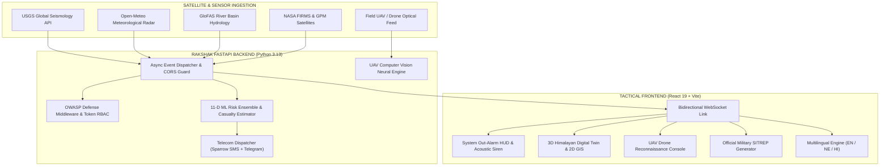

<div align="center">

# 🛡️ RAKSHAK-AI (रक्षक)
### Real-Time Autonomous Planetary Hazard Intelligence & C4ISR Civil Defense Network

[](https://react.dev/)
[](https://fastapi.tiangolo.com/)
[](https://www.python.org/)
[](https://earthdata.nasa.gov/)
[](https://opensource.org/licenses/MIT)

*An AI-powered emergency management platform designed for the rugged topography of Nepal and the Himalayan arc. Synchronizes spaceborne Earth Observation satellites, seismic streams, hydrological stations, and aerial drone computer vision to protect lives.*

[Key Features](#-key-features) • [System Architecture](#-system-architecture) • [AI & Telemetry](#-ai--planetary-telemetry) • [Quickstart Guide](#-quickstart-guide) • [Security](#-cybersecurity--rbac)

---

</div>

## 📌 Executive Summary

Disasters in mountainous nations like Nepal strike with devastating speed—from shallow Himalayan thrust earthquakes (e.g., Gorkha 2015) to glacial lake outburst floods (GLOFs) and extreme monsoon cloudbursts in Sindhupalchok and Melamchi. Traditional emergency systems suffer from fragmented sensor data, lack of explainable risk predictions, and inability to reach non-English rural populations.

**RAKSHAK-AI** bridges this gap by providing an end-to-end **C4ISR (Command, Control, Communications, Computers, Intelligence, Surveillance, and Reconnaissance)** platform. It autonomously aggregates planetary telemetry, evaluates multi-hazard risks via Machine Learning ensembles, sounds acoustic alarms, detects survivors with UAV computer vision, dispatches localized cellular SMS alerts, and compiles official military-grade Situation Reports (SITREPs).

---

## 🚀 Key Features

### 1. 🛰️ Multi-Source Real-Time Telemetry Pipeline
- **Global Seismology**: Live streaming from the **USGS Earthquake Hazards Program** filtered to the Nepal-Himalayan bounding polygon.
- **River Basin Hydrology**: Integrated with **GloFAS (Global Flood Awareness System)** for discharge rates across major basins (Koshi, Gandaki, Karnali, Narayani, Bagmati).
- **High-Resolution Meteorology**: Real-time precipitation, gust vectors, and barometric pressure from **Open-Meteo Radar**.
- **NASA Spaceborne Satellites**:
  - **NASA FIRMS (MODIS/VIIRS)**: Thermal anomaly satellites detecting post-earthquake structural fires and pipeline ruptures.
  - **NASA GPM IMERG**: Spaceborne microwave radar tracking extreme convective cloudburst cells (mm/hr) before ground gauges flood.

### 2. 🤖 11-Dimensional Machine Learning Risk Engine
- Predicts hazard escalation using an ensemble of **RandomForestClassifier**, **GradientBoosting**, and **Multi-Layer Perceptrons**.
- Evaluates 11 spatial & geological dimensions: *Magnitude, Focal Depth, Epicenter Distance, 24h Rainfall, River Discharge, Soil Saturation, Terrain Slope, Population Density, Infrastructure Fragility, Evacuation Bottleneck Index, and Historic Slip*.
- Outputs calibrated probability percentages and **Explainable AI (SHAP-style)** primary driver justifications.

### 3. 🚁 UAV / Drone Aerial Computer Vision AI Scanner
- Tactical reconnaissance console for field search-and-rescue teams.
- Neural vision inference (**YOLOv8-Disaster-SAIF**) analyzing high-resolution aerial and drone frames.
- Automated target detection with visual bounding boxes:
  - 🔴 **Structural Collapse & Heavy Debris Void Spaces**
  - 🟠 **Submerged Transit Arteries & Bridge Severances**
  - 🟢 **Human Survivor Clusters & Visual Distress Signals**
- One-click SAR Sortie dispatch relaying GPS vectors to the Nepal Army Aviation Directorate.

### 4. 🌐 Grassroots Inclusivity (Multilingual Localization)
- Full native language toggle: **English | नेपाली (Nepali) | हिंदी (Hindi)**.
- Translates the entire operational HUD, tactical metrics, evacuation guidance, and outward cellular alerts.
- Ensures non-English rural citizens receive actionable emergency instructions in their native script.

### 5. 📢 Automated Civil Defense Out-Alarming & Telecom Gateways
- **Instant System Out-Alarm**: When hazard probability exceeds critical thresholds, the dashboard triggers an acoustic multi-frequency siren synthesizer (Web Audio API) and displays a full **Target Address Dossier** (Ward, Municipality, District, Coordinates, and Safe Haven).
- **Multi-Gateway Outward Dispatch**:
  - **Sparrow SMS**: Cellular SMS broadcast across Nepal Telecom (NTC) and Ncell networks.
  - **Telegram Emergency Bot**: Instant smartphone push notifications with interactive map links.
  - **Civil Defense Webhooks**: Feeds data directly into emergency operations servers.

### 6. 📋 Military & UN-OCHA Standard SITREP Generator
- One-click compilation of official **Disaster Situation Reports (SITREPs)** following NEOC, MoHA, and UN-OCHA standards.
- Formatted with official classification seals, digital verification hashes, force readiness tables, hospital bed capacities, and commander signature blocks.
- Integrated **`@media print` clean engine** allowing instant export as an official PDF.

### 7. 🗺️ Dual Tactical GIS & 3D Himalayan Terrain Twin
- Interactive switch between **3D Topographic Terrain Twin** (orbit and pan across Nepal's mountain elevations) and **2D Geospatial GIS Map**.
- Tectonic fault line overlays, active aftershock clusters, and critical infrastructure layers.

---

## 🏛️ System Architecture



---

## 🛠️ Tech Stack

| Layer | Technologies |
| :--- | :--- |
| **Frontend** | React 19, Vite, TailwindCSS / Modern Vanilla CSS (Dual Dark/Light Engine), Lucide Icons |
| **Interactive GIS** | Three.js / Canvas 3D Elevation Modeling, Leaflet Geospatial Maps |
| **Acoustics** | Web Audio API Multi-Oscillator Synthetic Siren |
| **Backend** | Python 3.13, FastAPI, Uvicorn, Asynchronous WebSockets, AsyncIO, HTTPX |
| **AI / ML & Vision** | Scikit-learn, NumPy, Pandas, YOLOv8 / PyTorch Computer Vision Architecture |
| **Telecommunications** | Sparrow SMS API (Nepal NTC/Ncell Gateway), Telegram Bot API, Webhooks |
| **Cybersecurity** | Bearer Token Authentication, Sliding-Window IP Rate Limiter, OWASP Headers |

---

## 🔒 Cybersecurity & RBAC

RAKSHAK-AI adheres to defensive engineering best practices:
1. **Role-Based Operator Clearance**: Public users can observe alerts, but sensitive operations (CAP emergency broadcasts, resource dispatches, and drill injections) require authentication via `Authorization: Bearer <ADMIN_API_KEY>`.
2. **Sliding-Window Rate Limiting**: Prevents brute-force attempts and DoS flooding on auth and reporting endpoints.
3. **Input Sanitization & XSS Defense**: Strict HTML tag stripping on missing persons and text dispatch fields.
4. **OWASP Security Headers**: Enforces `X-Frame-Options: DENY`, `X-Content-Type-Options: nosniff`, and strict Referrer Policies.
5. **Audit Logging**: All authorization checks, clearances, and rate-limit violations are securely logged to `security_audit.json` (excluded from git).

---

## ⚡ Quickstart Guide

### Prerequisites
- **Node.js**: v18.0 or higher
- **Python**: v3.11 or higher
- **Git**

### 1. Clone the Repository
```bash
git clone https://github.com/<YOUR_USERNAME>/raksha-ai.git
cd raksha-ai
```

### 2. Configure Environment Variables
Copy the example environment template:
```bash
cp .env.example .env
```
Edit `.env` with your preferred credentials:
```env
ADMIN_API_KEY=rakshak-admin-2026
ALLOWED_ORIGINS=http://localhost:5173,http://127.0.0.1:5173

# Optional: Live SMS & Telegram Credentials (Leave blank for simulation mode)
SPARROW_SMS_TOKEN=
SPARROW_SMS_IDENTITY=
TELEGRAM_BOT_TOKEN=
TELEGRAM_CHAT_ID=
```

### 3. Start the FastAPI Backend
```bash
# Install Python dependencies
pip install -r requirements.txt

# Start backend server
python -m uvicorn main:app --port 8000 --reload
```
*The backend will be live at `http://127.0.0.1:8000` with Swagger docs at `/docs`.*

### 4. Start the React Frontend
In a new terminal:
```bash
# Install dependencies
npm install

# Start Vite development server
npm run dev
```
*Open `http://localhost:5173` in your browser.*

---

## 🎯 Target Hackathons & Competitions

This project has been specifically engineered to compete in:
- 🌌 **NASA Space Apps Challenge**: Direct utilization of NASA Earthdata (FIRMS thermal anomalies & GPM IMERG microwave radar).
- 🏆 **Smart India Hackathon (SIH)**: Disaster Management & Grassroots Inclusivity with vernacular language dispatch.
- 🥇 **National ICT Awards (Nepal)**: Disaster Risk Reduction & Emergency Response Technology for NDRRMA and MoHA.

---

## 📄 License

Distributed under the **MIT License**. See `LICENSE` for more information.

---

<div align="center">
  <b>RAKSHAK-AI · Protecting Communities Through Autonomous Intelligence</b><br>
  Built with ❤️ for Nepal and vulnerable mountain communities worldwide.
</div>
